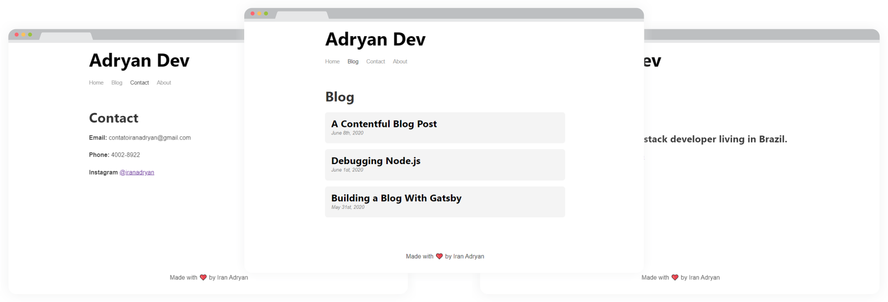

<h1 align="center">Gatsby Blog</h1>
 
## Sobre  

Blog estático desenvolvido com Gatsby e seus plugins para que possa ser alimentado através do [contentful](https://www.contentful.com/) de maneira simples.

## Tecnologias  

Criado com:  

- [x] **ReactJS** 
- [x] **Gatsby**   
- [x] **Contentful**  
- [x] **Sass**
  

## Resultados
<p align="center"></p>

## Execute a aplicação  
Para executar é necessário uma conta no contentful e criar um content model com os seguintes campos:
- Title - *short text*
- Slug - *short text*
- Published date - *date & time*
- Body - *rich text*

```sh  
#Instale as dependências  
$ npm install  

#Crie um arquivo .env
CONTENTFUL_SPACE_ID=[Space ID contentful]
CONTENTFUL_ACCESS_TOKEN=[Acces token da sua conta]
  
#Inicie a aplicação  
$ npm start  
```  

A aplicação vai está rodando em [http://localhost:8000](http://localhost:8000)  
  

## License  

Esse projeto está sob a licença MIT. Veja o arquivo [LICENSE](https://github.com/iranadryan/gatsby-blog/blob/master/LICENSE) para mais detalhes.
